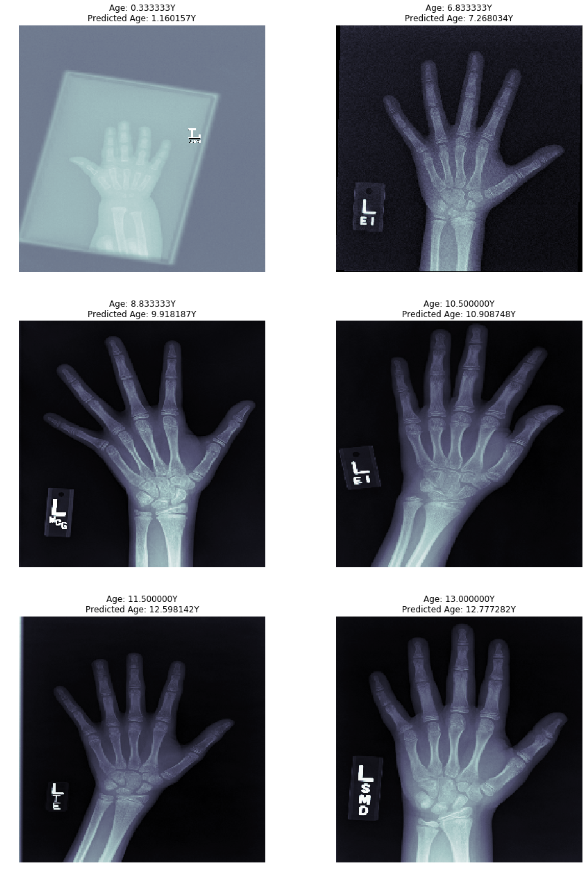

# BoneAgePrediction
This notebook is an attempt to predict bone age using Xception(pre-trained model)

This notebook explores the dataset used in the Pediatric Bone Age Challenge, 2017, commonly known as the RSNA(Radiological Society of North America), and attempts to predict the ages of children using X-ray images of their hands. More information about the dataset as well as the dataset itself can be found on Kaggle <a href = 'https://www.kaggle.com/kmader/rsna-bone-age'>here.</a> 
## Model description
The notebook uses the pre-trained model Xception to predict ages. The ImageDataGenerator class from Keras has been used to enable efficient loading, preprocessing, and augmentation of the dataset. The model obtained a mean absolute error of approximately 7.6 months. 
## Requirements
<ul>
  <li> <b>Tensorflow:</b> To use Xception and related functions for training and preprocessing</li>
  <li><b> Numpy:</b> To work with the dataset</li> 
  <li><b> Pandas:</b> To load CSV files and plot data</li>
  <li><b> Matplotlib:</b> To create visualisations</li>
  <li><b> Seaborn:</b> To create visualisations</li>
  <li><b>Sklearn:</b> To split data into training and validation</li>
  </ul>
  
## Results
</img>
  
